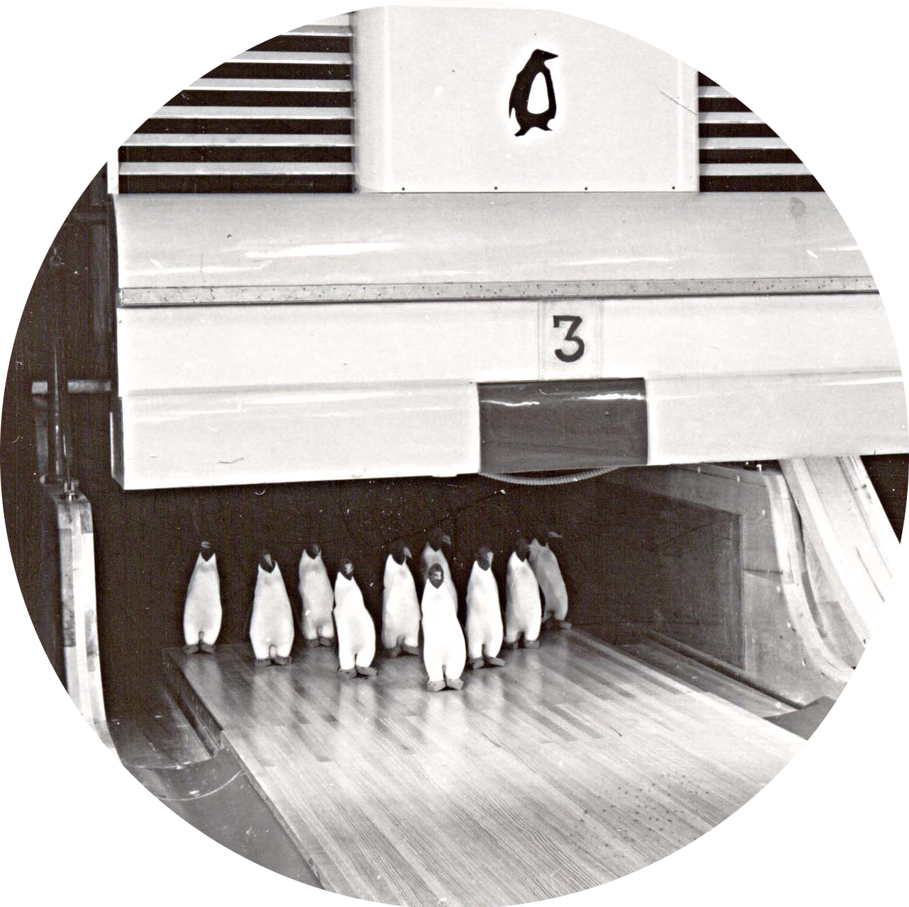

<h1>Bowling Game</h1>

A bowling game using [Babylon.js](https://www.babylonjs.com) 3D engine.

I hope to create scenes and interesting physics over time. Perhaps at some point allow players to choose their arena or choose different bowling rules.

> :warning: This project is a work-in-progress. It does not working game yet.
